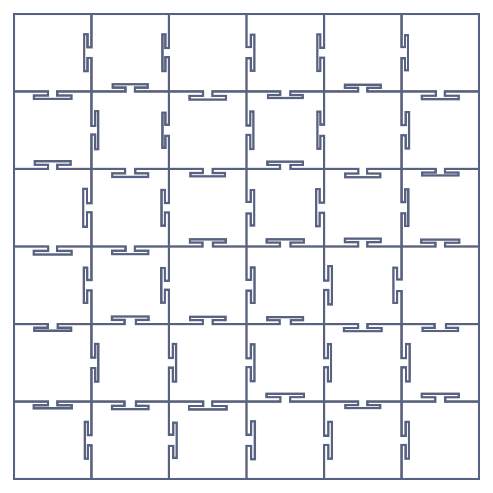

# 🧩 Appegy: Tessera

[](https://openupm.com/packages/com.appegy.tessera/)
[](LICENSE)
[](https://appegy.github.io/Tessera/)

2D grid geometry for Unity: square, hexagonal, Voronoi and jigsaw-puzzle tessellations behind a single, immutable interface.

### 👉 [Try the live demo](https://appegy.github.io/Tessera/)

## Overview

Most 2D games need a grid - and then need the same boring things from it: where is each cell, what is its
shape, which cells are adjacent, which cell is under the cursor, how far apart are two cells. Tessera computes
that geometry and topology for you across four very different tessellations, so you write the gameplay once
against one interface instead of re-deriving hex math or Voronoi adjacency by hand.

- One interface, `ITessellation`, for every grid type: cells are dense integer ids in `[0, CellCount)`.
- Per-cell **geometry** (centre, corner polygon) and **topology** (neighbours, adjacency, hop distance) exposed separately.
- Point picking: `GetCellAt(point)` returns the cell under any position, or `-1` when outside.
- Allocation-free corner reads via `CopyCorners(id, Span<float2>)`.
- Pure data: built on `Unity.Mathematics` (`float2`), no scene objects or `MonoBehaviour` required.

## Installation

### OpenUPM

```
openupm add com.appegy.tessera
```

### Git URL

Add the package to your `Packages/manifest.json`:

```json
"dependencies": {
  "com.appegy.tessera": "https://github.com/Appegy/Tessera.git?path=/src"
}
```

Pin a specific version by appending a tag:

```json
"com.appegy.tessera": "https://github.com/Appegy/Tessera.git?path=/src#1.0.1"
```

## Usage

Pick the tessellation that fits your game, build it, then drive everything through `ITessellation`.
The construction differs per type; everything after that is identical.

- [Square](#square) - regular row/column lattice, 4 neighbours.
- [Hexagonal](#hexagonal) - honeycomb, pointy or flat top, 6 neighbours.
- [Voronoi](#voronoi) - organic, irregular cells from scattered sites.
- [Classic Puzzle](#classic-puzzle) / [Draradech Puzzle](#draradech-puzzle) / [Geometric](#geometric) - interlocking jigsaw tiles.

```csharp
using Appegy.Tessera;
using Unity.Mathematics;

// 1. Build the grid you want (see "Grid types" below for each constructor).
ITessellation grid = new SquareGrid(width: 10, height: 8, cellSize: 1f);

// 2. From here on the type no longer matters - it's all ITessellation.
for (var id = 0; id < grid.CellCount; id++)
{
    float2 center = grid.GetCenter(id);

    Span<float2> corners = stackalloc float2[grid.GetCornersCount(id)];
    grid.CopyCorners(id, corners); // clockwise outline, allocation-free

    foreach (var neighbor in grid.Neighbors(id))
    {
        // adjacent cell across each shared edge
    }
}
```

### Common tasks

Coordinates are in tessellation-local space (`grid.Bounds`). These work the same for every grid type.

**Draw or spawn something per cell** - iterate the dense id range and read each cell's centre and outline:

```csharp
for (var id = 0; id < grid.CellCount; id++)
{
    float2 center = grid.GetCenter(id);
    Span<float2> corners = stackalloc float2[grid.GetCornersCount(id)];
    grid.CopyCorners(id, corners); // ready to triangulate or stroke
}
```

**Find the cell under a point** (mouse, touch, projectile) - `GetCellAt` returns `-1` when the point is outside:

```csharp
int id = grid.GetCellAt(localPoint);
if (id != -1)
{
    // hit cell `id`
}
```

**Visit a cell's neighbours** - the `Neighbors` extension yields only real neighbours (edge slots are skipped):

```csharp
foreach (var neighbor in grid.Neighbors(id))
{
    // adjacent cell across each shared edge
}
```

**Measure distance / range** - `Distance` is the minimum number of cell-to-cell hops:

```csharp
bool inRange = grid.Distance(from, to) <= moveBudget;
bool touching = grid.AreNeighbors(a, b);
```

**Flood-fill within N steps** (movement range, blast radius, region select) - a breadth-first walk over neighbours:

```csharp
var reachable = new HashSet<int> { start };
var frontier = new Queue<int>();
frontier.Enqueue(start);
while (frontier.Count > 0)
{
    var cell = frontier.Dequeue();
    if (grid.Distance(start, cell) >= maxSteps) continue;
    foreach (var next in grid.Neighbors(cell))
        if (reachable.Add(next))
            frontier.Enqueue(next);
}
```

## Grid types

### Square

<picture>
  <source media="(prefers-color-scheme: dark)" srcset="images/square-dark.webp">
  
</picture>

A regular `width × height` lattice of square cells; every interior cell has 4 neighbours.

| Parameter | Type | Description |
| --- | --- | --- |
| `width` | `int` | Number of columns (> 0). |
| `height` | `int` | Number of rows (> 0). |
| `cellSize` | `float` | Edge length of each cell in world units (> 0). |

```csharp
var grid = new SquareGrid(width: 16, height: 9, cellSize: 1f);

// Convenience id <-> coordinate helpers (square only).
int id = grid.IdOf(x: 3, y: 5);
(int x, int y) = grid.XYOf(id);
```

### Hexagonal

<picture>
  <source media="(prefers-color-scheme: dark)" srcset="images/hexagonal-dark.webp">
  
</picture>

A `width × height` hexagonal lattice; every interior cell has 6 neighbours.

| Parameter | Type | Description |
| --- | --- | --- |
| `width` | `int` | Number of columns (> 0). |
| `height` | `int` | Number of rows (> 0). |
| `inscribedRadius` | `float` | Distance from a hex centre to an edge, in world units (> 0). |
| `type` | `HexagonalGridType` | Orientation and row/column offset (see below). |

`HexagonalGridType` selects the layout:

| Value | Meaning |
| --- | --- |
| `PointyOdd` | Pointy-top hexes, odd rows shifted right. |
| `PointyEven` | Pointy-top hexes, even rows shifted right. |
| `FlatOdd` | Flat-top hexes, odd columns shifted up. |
| `FlatEven` | Flat-top hexes, even columns shifted up. |

```csharp
var grid = new HexagonalGrid(width: 12, height: 10, inscribedRadius: 0.5f, HexagonalGridType.PointyOdd);
```

### Voronoi

<picture>
  <source media="(prefers-color-scheme: dark)" srcset="images/voronoi-dark.webp">
  
</picture>

Scatters random sites inside a rectangle and builds the Voronoi diagram, giving irregular convex cells with
varying neighbour counts. Optional Lloyd relaxation evens the cells out.

| Parameter | Type | Description |
| --- | --- | --- |
| `bounds` | `Bounds2` | Rectangle the sites are scattered in (also the grid's extent). |
| `cellCount` | `int` | Number of sites, i.e. number of cells. |
| `seed` | `int` | RNG seed; the same seed always reproduces the same layout. |
| `relaxationIterations` | `int` | Lloyd passes. `0` = raw random; higher = more uniform, rounder cells. |

```csharp
var bounds = new Bounds2(float2.zero, new float2(20f, 12f));
var grid = new VoronoiGrid(bounds, cellCount: 120, seed: 1337, relaxationIterations: 2);
```

### Classic Puzzle

<picture>
  <source media="(prefers-color-scheme: dark)" srcset="images/classic-puzzle-dark.webp">
  
</picture>

A `width × height` field of jigsaw tiles that interlock via classic rounded tabs and blanks. The tab silhouette
is fully tunable through `ClassicPuzzleParameters`.

| Parameter | Type | Description |
| --- | --- | --- |
| `width` | `int` | Number of tile columns (> 0). |
| `height` | `int` | Number of tile rows (> 0). |
| `cellSize` | `float` | Base tile size in world units, before tabs (> 0). |
| `seed` | `int` | Decides which edges get a tab vs a blank; reproducible. |
| `parameters` | `ClassicPuzzleParameters` | Optional tab shape (defaults to `ClassicPuzzleParameters.Default`). |

`ClassicPuzzleParameters` - all values are normalized to `[0, 1]` (clamped; default `0.5` each, deform/neck `0`):

| Field | Description |
| --- | --- |
| `roundness` | How much the straight edges bow outward. |
| `tabRadius` | Size of the tab head (the knob). |
| `tabOffset` | How far the head sticks out from the edge. |
| `tabDeform` | Sideways lean of the tab along the edge. |
| `tabNeck` | Neck waist width - higher reads as a thicker neck and rounder corners. |

```csharp
// Default tabs.
var classic = new ClassicPuzzleGrid(width: 8, height: 6, cellSize: 1f, seed: 42);

// Custom tab shape.
var custom = new ClassicPuzzleGrid(
    width: 8, height: 6, cellSize: 1f, seed: 42,
    new ClassicPuzzleParameters(roundness: 0.5f, tabRadius: 0.5f, tabOffset: 0.5f));
```

### Draradech Puzzle

<picture>
  <source media="(prefers-color-scheme: dark)" srcset="images/draradech-puzzle-dark.webp">
  
</picture>

An alternative jigsaw style with a smoother, more organic tab silhouette, tuned through `DraradechPuzzleParameters`.

| Parameter | Type | Description |
| --- | --- | --- |
| `width` | `int` | Number of tile columns (> 0). |
| `height` | `int` | Number of tile rows (> 0). |
| `cellSize` | `float` | Base tile size in world units, before tabs (> 0). |
| `seed` | `int` | Decides tab/blank orientation per edge; reproducible. |
| `parameters` | `DraradechPuzzleParameters` | Optional tab shape (defaults to `DraradechPuzzleParameters.Default`). |

`DraradechPuzzleParameters` - all values are normalized to `[0, 1]` (clamped; default `0.5` each):

| Field | Description |
| --- | --- |
| `tabSize` | Size of the interlocking tab. |
| `variation` | Random jitter between tabs - higher is more irregular. |
| `smoothness` | Curve smoothness (number of Bézier subdivisions per edge). |

```csharp
// Default tabs.
var draradech = new DraradechPuzzleGrid(width: 8, height: 6, cellSize: 1f, seed: 7);

// Custom tab shape.
var custom = new DraradechPuzzleGrid(
    width: 8, height: 6, cellSize: 1f, seed: 7,
    new DraradechPuzzleParameters(tabSize: 0.5f, variation: 0.5f, smoothness: 0.5f));
```

### Geometric

<picture>
  <source media="(prefers-color-scheme: dark)" srcset="images/geometric-dark.webp">
  
</picture>

A polygonal jigsaw style: each tab is a fixed 10-vertex polyline with no curves, so it is the cheapest tab
style to mesh and a good fit for low-poly. The head is wider than the neck, so pieces lock mechanically
(dovetail). Tuned through `GeometricParameters`.

| Parameter | Type | Description |
| --- | --- | --- |
| `width` | `int` | Number of tile columns (> 0). |
| `height` | `int` | Number of tile rows (> 0). |
| `cellSize` | `float` | Base tile size in world units, before tabs (> 0). |
| `seed` | `int` | Decides tab/blank orientation per edge; reproducible. |
| `parameters` | `GeometricParameters` | Optional tab shape (defaults to `GeometricParameters.Default`). |

`GeometricParameters` - all values are normalized to `[0, 1]` (clamped; default `0.5` each). Each knob drives
exactly one visual quantity, independently:

| Field | Description |
| --- | --- |
| `headDepth` | How far the tab head sticks out from the edge. |
| `headWidth` | Width of the locking head - wider reads as a stronger interlock. |
| `neckWidth` | Width of the neck waist below the head. |
| `variation` | Per-edge random jitter of depth, width, and neck - higher is more irregular. |

```csharp
// Default tabs.
var geometric = new GeometricGrid(width: 8, height: 6, cellSize: 1f, seed: 7);

// Custom tab shape.
var custom = new GeometricGrid(
    width: 8, height: 6, cellSize: 1f, seed: 7,
    new GeometricParameters(headDepth: 0.5f, headWidth: 0.5f, neckWidth: 0.5f, variation: 0.5f));
```

> The puzzle grids expose extra per-side outline detail via `GetSidePolylineLength(id, side)` and
> `CopySidePolyline(id, side, dest)`, useful for rendering the tab edges at full fidelity.

## License

[MIT](LICENSE) © Appegy
