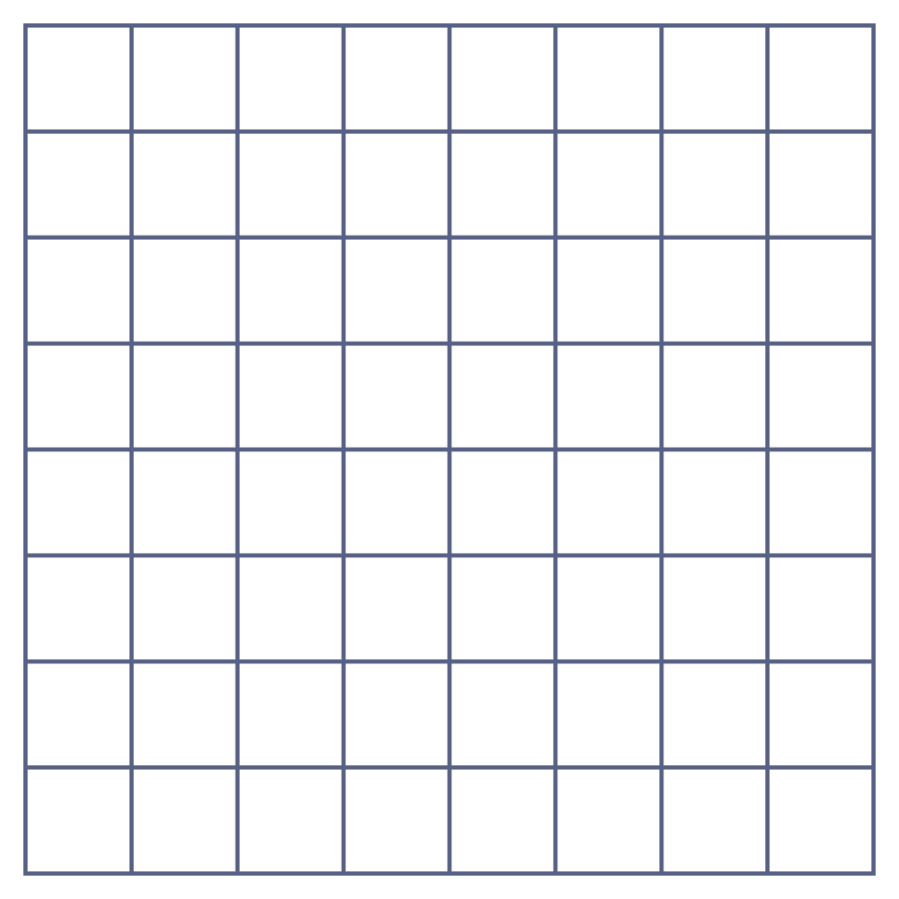
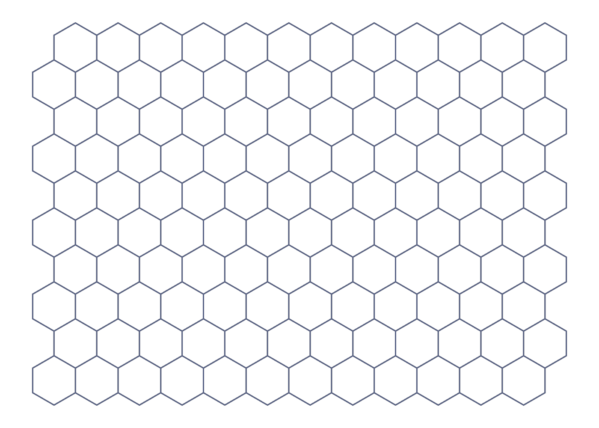
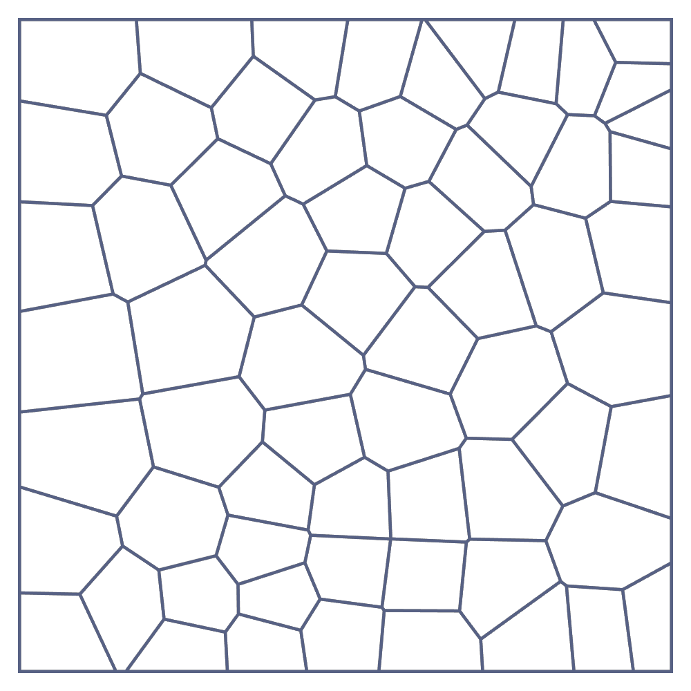
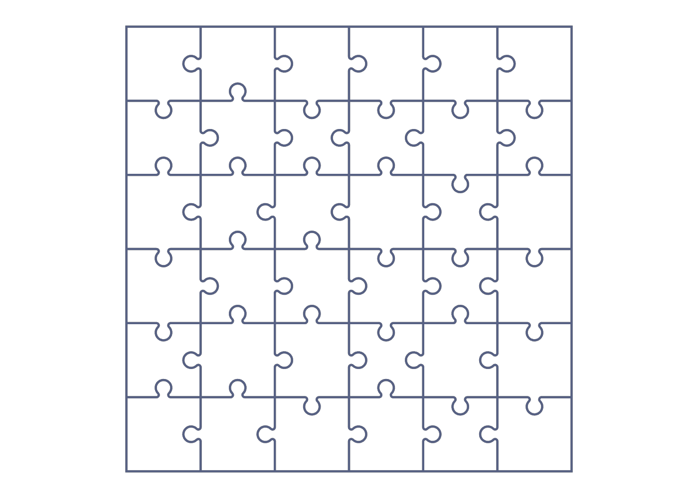
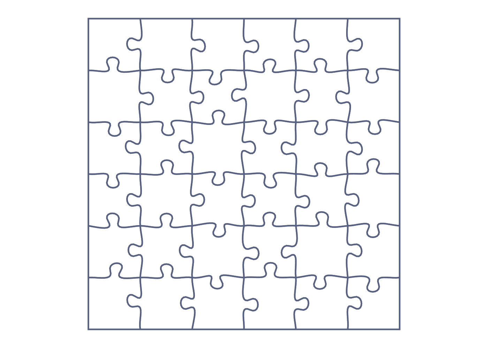

# 🧩 Appegy: Tessera

[](https://openupm.com/packages/com.appegy.tessera/)
[](LICENSE)
[](https://appegy.github.io/Tessera/)

2D grid geometry for Unity: square, hexagonal, Voronoi and jigsaw-puzzle tessellations behind a single, immutable interface.

### 👉 [Try the live demo](https://appegy.github.io/Tessera/)

## Features

- One interface, `ITessellation`, for every grid type: cells are dense integer ids in `[0, CellCount)`.
- Per-cell **geometry** (centre, corner polygon) and **topology** (neighbours, adjacency, hop distance) exposed separately.
- Point picking: `GetCellAt(point)` returns the cell under any position, or `-1` when outside.
- Allocation-free corner reads via `CopyCorners(id, Span<float2>)`.
- Built on `Unity.Mathematics` (`float2`), no scene objects or `MonoBehaviour` required.

## Supported grid types

| Type | Class | Notes |
| --- | --- | --- |
| Square | `SquareGrid` | Regular `width × height` lattice, 4 neighbours per cell. |
| Hexagonal | `HexagonalGrid` | Pointy/flat orientation with odd/even offset (`HexagonalGridType`), 6 neighbours. |
| Voronoi | `VoronoiGrid` | Seeded random sites with optional Lloyd relaxation; cell shapes vary. |
| Puzzle | `ClassicPuzzleGrid`, `DraradechPuzzleGrid` | Jigsaw tiles with interlocking tabs; tunable tab shape. |

## Installation

### OpenUPM

```
openupm add com.appegy.tessera
```

### Git URL

Add the package to your `Packages/manifest.json`:

```json
"dependencies": {
  "com.appegy.tessera": "https://github.com/Appegy/Tessera.git?path=/src"
}
```

Pin a specific version by appending a tag:

```json
"com.appegy.tessera": "https://github.com/Appegy/Tessera.git?path=/src#1.0.1"
```

## Quick start

Every grid implements `ITessellation`, so the same code works for any type.

```csharp
using Appegy.Tessera;
using Unity.Mathematics;

// Build a 10×8 square grid with a cell size of 1.
ITessellation grid = new SquareGrid(width: 10, height: 8, cellSize: 1f);

// Iterate every cell.
for (var id = 0; id < grid.CellCount; id++)
{
    float2 center = grid.GetCenter(id);

    // Read the cell outline (clockwise, allocation-free).
    Span<float2> corners = stackalloc float2[grid.GetCornersCount(id)];
    grid.CopyCorners(id, corners);

    // Walk neighbours (skips the -1 boundary slots).
    foreach (var neighbor in grid.Neighbors(id))
    {
        // ...
    }
}

// Pick the cell under a world position.
int picked = grid.GetCellAt(new float2(3.2f, 4.7f));

// Topology helpers.
int hops = grid.Distance(0, grid.CellCount - 1);
```

## Common usage

Once you have an `ITessellation` (any grid type - see [Quick start](#quick-start)), everything below works
the same way. Coordinates are in tessellation-local space (`grid.Bounds`).

**Draw or spawn something per cell** - iterate the dense id range and read each cell's centre and outline:

```csharp
for (var id = 0; id < grid.CellCount; id++)
{
    float2 center = grid.GetCenter(id);
    Span<float2> corners = stackalloc float2[grid.GetCornersCount(id)];
    grid.CopyCorners(id, corners); // clockwise polygon, ready to triangulate or stroke
}
```

**Find the cell under a point** (mouse, touch, projectile) - `GetCellAt` returns `-1` when the point is outside:

```csharp
int id = grid.GetCellAt(localPoint);
if (id != -1)
{
    // hit cell `id`
}
```

**Visit a cell's neighbours** - the `Neighbors` extension yields only real neighbours (edge slots are skipped):

```csharp
foreach (var neighbor in grid.Neighbors(id))
{
    // adjacent cell across each shared edge
}
```

**Measure distance / range** - `Distance` is the minimum number of cell-to-cell hops:

```csharp
bool inRange = grid.Distance(from, to) <= moveBudget;
bool touching = grid.AreNeighbors(a, b);
```

**Flood-fill within N steps** (movement range, blast radius, region select) - a breadth-first walk over neighbours:

```csharp
var reachable = new HashSet<int> { start };
var frontier = new Queue<int>();
frontier.Enqueue(start);
while (frontier.Count > 0)
{
    var cell = frontier.Dequeue();
    if (grid.Distance(start, cell) >= maxSteps) continue;
    foreach (var next in grid.Neighbors(cell))
        if (reachable.Add(next))
            frontier.Enqueue(next);
}
```

## Grid types overview

### Square

<picture>
  <source media="(prefers-color-scheme: dark)" srcset="images/square-dark.webp">
  
</picture>

```csharp
var grid = new SquareGrid(width: 16, height: 9, cellSize: 1f);
int id = grid.IdOf(x: 3, y: 5);
(int x, int y) = grid.XYOf(id);
```

### Hexagonal

<picture>
  <source media="(prefers-color-scheme: dark)" srcset="images/hexagonal-dark.webp">
  
</picture>

`inscribedRadius` is the distance from a hex centre to an edge. `HexagonalGridType` selects orientation and offset:
`PointyOdd`, `PointyEven`, `FlatOdd`, `FlatEven`.

```csharp
var grid = new HexagonalGrid(width: 12, height: 10, inscribedRadius: 0.5f, HexagonalGridType.PointyOdd);
```

### Voronoi

<picture>
  <source media="(prefers-color-scheme: dark)" srcset="images/voronoi-dark.webp">
  
</picture>

Scatters `cellCount` sites inside `bounds`, builds the Voronoi diagram, and applies `relaxationIterations`
Lloyd passes to even out the cells. `seed` makes the layout reproducible.

```csharp
var bounds = new Bounds2(float2.zero, new float2(20f, 12f));
var grid = new VoronoiGrid(bounds, cellCount: 120, seed: 1337, relaxationIterations: 2);
```

### Puzzle

<picture>
  <source media="(prefers-color-scheme: dark)" srcset="images/classic-puzzle-dark.webp">
  
</picture>
<picture>
  <source media="(prefers-color-scheme: dark)" srcset="images/draradech-puzzle-dark.webp">
  
</picture>

Jigsaw grids lay out a `width × height` tile field where adjacent tiles interlock via tabs and blanks.
Two tab styles are available (`ClassicPuzzleGrid` and `DraradechPuzzleGrid`); both accept a
parameters struct (or `Default`) to tune the tab shape.

```csharp
// Classic interlocking tabs.
var classic = new ClassicPuzzleGrid(width: 8, height: 6, cellSize: 1f, seed: 42);

// Tunable tab shape.
var custom = new ClassicPuzzleGrid(
    width: 8, height: 6, cellSize: 1f, seed: 42,
    new ClassicPuzzleParameters(roundness: 0.5f, tabRadius: 0.5f, tabOffset: 0.5f));

// Alternative (Draradech) style.
var draradech = new DraradechPuzzleGrid(width: 8, height: 6, cellSize: 1f, seed: 42);
```

Puzzle cells expose extra per-side outline detail via `GetSidePolylineLength(id, side)` and
`CopySidePolyline(id, side, dest)`, which is useful for rendering the curved tab edges.

## License

[MIT](LICENSE) © Appegy
